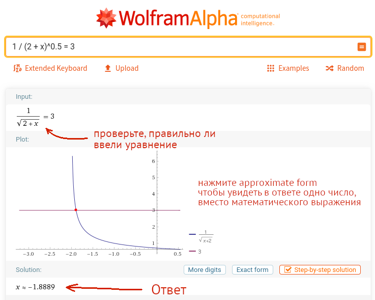

- если по заданиям возникли вопросы то можно писать мне на почту или в slack в канал СУС-16
- чтобы зарегистрироваться в slack нужен инвайт, инвайт могу отправить я или тот человек, кто уже зарегистрирован в slack
- конспекты можно делать письменные или распечатывать слайды лекции, добавляя туда свои примечания

# март 28. Практическое занятие
- Изучить слайды 20-22 [PSM_statistics.pdf](https://github.com/VetrovSV/ST/blob/master/PSM_statistics.pdf)
- Ответить на вопросы:
 - Что такое доверительный интервал?
 - Зачем нужны доверительные интервалы?
 - Что нужно знать, чтобы вычислить доверительный интервал для математического ожидания СВ распределённой по нормальному закону?
 - Чем отличается вычисление доверительного интервала для математического ожидания СВ распределённой по нормальному закону в случаях: а) известна дисперсия генеральной совокупности, б) известна дисперсия выборки?
- Решить задачи из [РУКОВОДСТВО К РЕШЕНИЮ ЗАДАЧ ПО ТЕОРИИ ВЕРОЯТНОСТЕЙ И МАТЕМАТИЧЕСКОЙ СТАТИСТИКЕ 11-е, изд, Гмурман В. Е.](https://biblio-online.ru/book/rukovodstvo-k-resheniyu-zadach-po-teorii-veroyatnostey-i-matematicheskoy-statistike-449645)
 - 506, 509 (см. пример решения в задаче 508)
 - *книга доступна по ссылке если библиотека ЗабГУ вас зарегистрировала в библиотеке*
 - для решения задач рекомендуется использовать программу Probability Distributions
 - t в задачах определяется из распределения Стьюдента (t распределение в программе)
 - В калькуляторе:
 - v = n - 1
 - 2P (X>|x|) = 1 - надёжность
 - x = t - вычисляется
- Решить те же задачи, только для надёжности 0.99


# апрель 10. Статистические гипотезы
## Практическое занятие
- Изучить слайды 23-50 PSM_statistics.pdf
- Ответить на вопросы:
 - Что такое статистическая гипотеза? Чем она отличается от обычной гипотезы?
 - Почему требуется проверять гипотезы работая с выборочными данными?
 - Что такое уровень значимости?
 - Как сделать вывод о статистической гипотезе по p-value?
- Решить задачи из РУКОВОДСТВО К РЕШЕНИЮ ЗАДАЧ ПО ТЕОРИИ .ВЕРОЯТНОСТЕЙ И МАТЕМАТИЧЕСКОЙ СТАТИСТИКЕ 11-е, изд, Гмурман В. Е.
- 567, 568, 570.
- В задачах, в дополнение к рассматриваемому там методу проверки гипотезы, использовать p-value (пример в лекции). Именно p-value широко используется на практике при проверке гипотез. П
 - для решения задач рекомендуется использовать программу Probability Distributions


 # апрель 18 - 25.
 ## Лекция
 - изучить слайды лекции https://github.com/VetrovSV/ST/blob/master/PSM_statistics.pdf

 ## Практическое занятие
 - РГР по статистической обработке данных: https://github.com/VetrovSV/ST/blob/master/task1/%D0%97%D0%B0%D0%B4%D0%B0%D0%BD%D0%B8%D0%B5.%20%D0%A1%D1%82%D0%B0%D1%82%D0%B8%D1%81%D1%82%D0%B8%D0%BA%D0%B0.pdf
 - эта работа рассчитана на два занятия
 - Для запуска программы, выполняющей все расчёты онлайн нужно перейти по ссылке:
 https://mybinder.org/v2/gh/VetrovSV/ST/master
 - загрузка может занять около минуты
 - выбрать папку task1
 - затем файл Python. Statistics 2.ipynb
 - указать файл с данными, соответствующими варианту (см. пример ниже)
 - например, для варианта 7 нужно указать data/V07.csv
 - номера вариантов выбираются по алфавитному списку группы
 ```
 # загрузим данные из файла
 # здесь файл расположен в папке data, которая расположена в той же папке, что и эта программа
 # следует выбирать относительный путь к файлу и избегать использования кириллицы в пути
 data = pandas.read_csv("data/V29.csv")
 ```
- Запустить вычисления: Cell > Run All
- Сохранить всё на свой компьютер: File > Download as > HTML
- Этот файл понадобится на следующем занятии для оформления работы
- Если не сохранить результаты расчётов сразу, то mybinder через некоторое время не активности прекратит работу (но в браузере вкладка останется) и все действия придётся выполнять заново
- Изучить комментарии к расчётам и их результаты

 # май 16.

## Лекция
 - изучить слайды 1-34 лекции https://github.com/VetrovSV/ST/blob/master/PSM_reliability.pdf
 - перед рассмотрением примеров изучить раздел "Линеаризация функции случайного аргумента" в лекции https://github.com/VetrovSV/ST/blob/master/PSM_variables_2.pdf
- слудующие темы и текущее практическое занятие будут посвящены надёжности

## Практическое занятие
- Задание https://github.com/VetrovSV/ST/tree/master/tasks-2020/Самостоятельная%20работа.%20Надёжность%201.pdf
- В задании расчётная схема совпадает с примером 1 в лекции, про нагруженный стержень.
- Но в расчётах есть отличия:
  - нужно найти не надёжность, а площадь поперечного сечения
  - случайных величин, влияющих на ответ две: предел текучести и нагрузка.
  - в формуле среднего резерва несущей способности g будет не F, а среднее значение F (см. линеаризацию функции случайного аргумента)
  - в формуле стандартного отклонения резерва несущей способности Sg будет сумма двух производных g: по F и по Ry
 - Обратите внимание на единицы измерения величин. Приведите к нужной размерности перед вычислениями
- Для вычисления индекса надёжности используйте программу Probability Distributions
- В конце решения, вместо ручного выражения площади поперечного сечения, рекомендуется использовать математические программы.
  - Например https://wolframalpha.com. Установка не нужна. Все вычисления прямо в браузере.
  - Для определения неизвестной из уравнения достаточно записать уравнение в строку ввода. Все переменные в уравнении автоматически считаются неизвестными.
  - Если можно найти значение переменной, то wolframalpha это сделает.
  - Десятичный разделитель в числе - точка, запятая воспринимается как разделитель уравнений.
 


- загрузите в личный кабинет pdf файл (рукописное или печатное содержанием) с решением задачи. В файле должно быть:
    - расчётная схема
    - исходные данные для вашего варианта
    - основные уравнения, выражение неизвестных
    - ответ –  площадь в квадратных сантиметрах
    - проверка: определение надёжности по вычисленной площади поперечного сечения
 - если возникнут трудности или вопросы, то напишите мне в slack или на почту.
